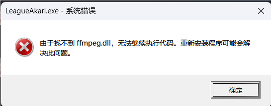
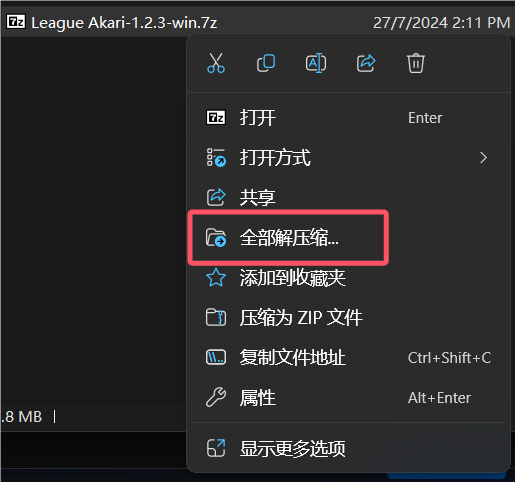
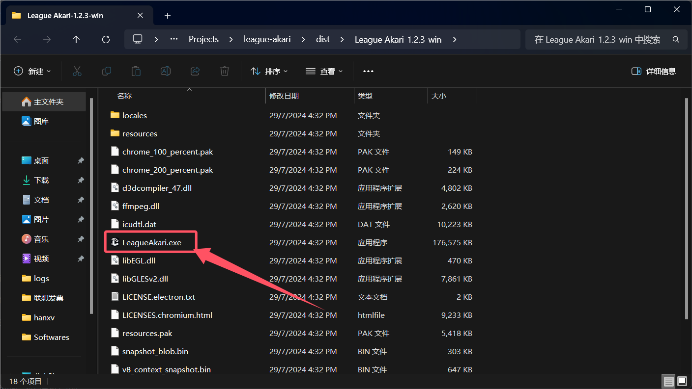
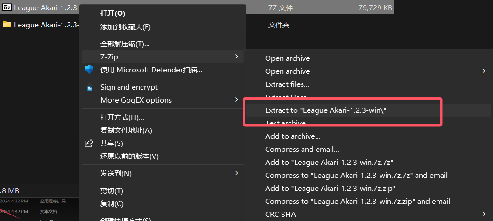
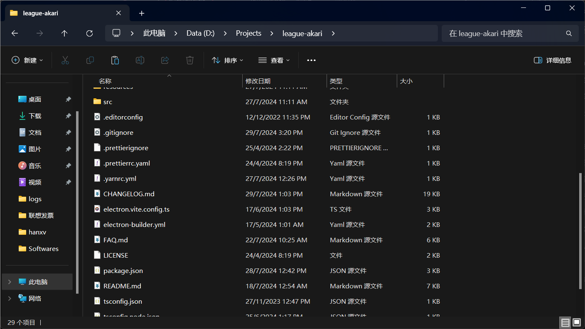
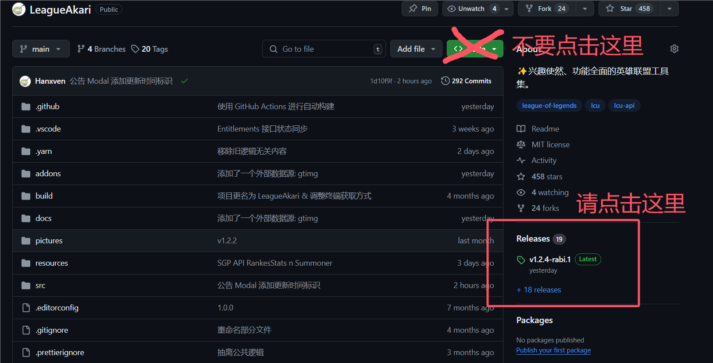
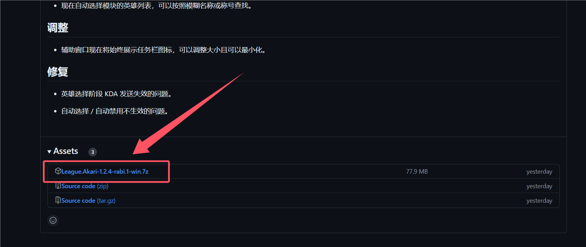
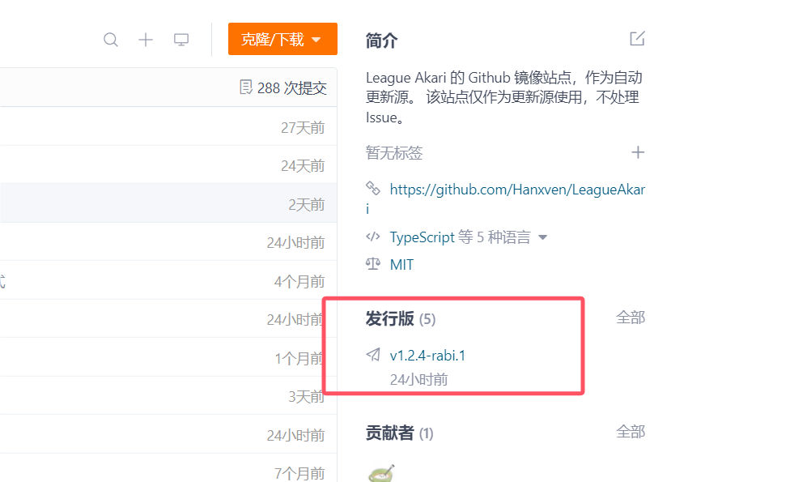
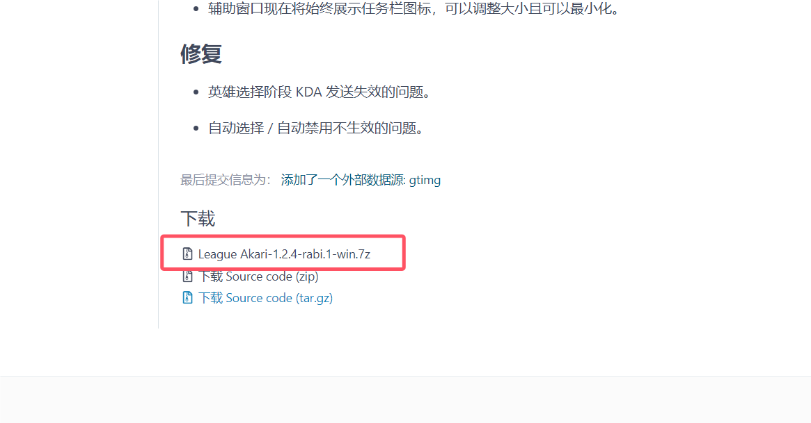

# 常见问题

这里记录了一些常见问题，如果你在使用过程中遇到了问题，可以先查看这里是否有解决方案。

## 运行不了怎么办？

“无法运行” 是一个很宽泛的描述，让我们来看看以下是否有符合你的情况。

### 忽略了解压步骤

如果发生如图所示的错误，说明你大概率**没有解压**并直接双击了压缩包内的 **LeagueAkari.exe** 试图运行。



在较新的 Windows 版本中，已经内置了解压工具。右键刚刚下载好的压缩包，点击**全部解压缩**并点击**提取**，解压完成后会出现一个文件夹，双击运行里面的 **LeagueAkari.exe** 即可使用。





当然，你也可以使用其他的解压缩软件，如 WinRAR、BandiZip 或 7-Zip 等。市面上几乎 99.99% 的解压软件都可以解压缩这个文件。

如下图是使用 7-Zip 的提取方式。



### 试图运行源码

你下载了文件，并且顺利地完成了高难度的解压操作，但得到的文件夹里面有很多奇怪的文件，找不到主程序，如图所示。



说明你下载的文件并不是 League Akari 的发行版本，而是源代码。源代码需要编译后才能运行，而编译需要一些开发环境和技术，不适合普通用户使用。

请按照如下图示，点击右侧的 “Releases” 下的具有 “Latest” 标识的文字。在新页面中，找到 “Assets” 下的 **LeagueAkari.7z**，下载并解压缩后运行 **LeagueAkari.exe** 即可。





::: tip 提示
在国内，Github 的下载速度可能会很慢，你可以尝试在 [Gitee 镜像仓库](https://gitee.com/Hanxven/LeagueAkari) 中下载，步骤与 Github 大同小异。




:::

### 老旧的 Windows 系统

League Akari 仅支持 **Windows 10** 及**以上**版本，并且只支持 **64** 位系统。

## League Akari 会导致封号吗？

League Akari 基于 Riot Games 的 API 进行数据获取，**理论上**不会违反任何[条款](https://developer.riotgames.com/policies/general)。

但是，仍不能保证其一定不会出现封号行为。已有部分使用者反映被封号，理由是 “修改客户端”，时长为一到三天不等。也有部分使用者反映封号十年，但立即被解封的情况。

另外，封号原因是多方面的，你需要先排除其他可能性，如使用了第三方软件（换肤、补丁或作弊软件）、违反了游戏规则等。

## 用着用着客户端突然闪退，是什么原因？

这是当前无法解决的问题，原因不明。猜测是游戏客户端（LeagueClient.exe）内部存在漏洞所致，尤其在英雄选择阶段。目前在 UX 客户端日志中没有找到明显的错误信息，以至于无法猜测具体原因。

一个不优雅的解决方案是禁用在英雄选择阶段的战绩查询类（包括战绩页面，对局分析）功能。

在新的版本 (1.2.3 及之后) 中，将战绩数据源设置为 SGP 可以大幅度减少闪退的概率。

## 为什么战绩查询出错？

在腾讯服务器艾欧尼亚大区，在晚间会出现战绩查询失败的情况，原因不明。

战绩查询的接口会返回 500 错误，系服务器问题。

## 为什么打完一局，战绩不更新？

战绩接口数据有时候会出现延迟，通常需要等待一段时间才能更新。League Akari 会在游戏结束的时候自动刷新战绩页面，但该时间点可能不是最新的数据。

## 为什么 WeGame 能查到战绩？

WeGame 的战绩查询是腾讯的另一套系统，而 League Akari 使用的是 Riot 提供的 LCU API。

## 记录的数据会共享吗？

不会。League Akari 只会在本地保存数据，不会上传到远程服务器。

## 我该如何彻底删除 League Akari？

League Akari 的文件包括两个部分：主程序目录和应用目录。

主程序目录包括了 LeagueAkari.exe 和其他文件，通常在下载的压缩包内。

应用目录会在第一次启动时**自动生成**，包括了配置文件、数据库文件等，通常在 `C:\Users\{用户名}\AppData\Roaming\league-akari` 目录下。您可以在设置 -> 调试 -> 打开应用目录打开该目录。

应用目录可以直接删除，但是会丢失一些数据（包括设置项、记录的历史玩家等）。

## 有换肤吗？能调视角吗？有野怪计时吗？

没有。League Akari 不提供任何涉及到游戏内的功能。

即使是游戏内发送消息，也是通过模拟键盘输入实现的，不会修改游戏客户端。

读取重生时间则是通过游戏端提供的 HTTP 接口实现的。

炫彩皮肤功能由于腾讯已经修复，不再提供。

## 支持台服（或其他服）吗？

支持。因为 League Akari 使用的是 LCU API，英雄联盟各服务器的的客户端都是一样的，所以理论上支持所有服务器。

## 为什么这软件这么贵？收我 79？

哈哈。

League Akari 是**免费开源**软件，不需要通过任何付费手段获取。如果您是通过非官方渠道被要求支付费用以下载或使用该软件，您已经被骗。

League Akari 会同时在 Github 和 Gitee 上发布并同步更新，您可以在这两个平台上免费获取到最新版本。

另外，作者不会通过任何方式向用户收取费用，不会接受私人捐赠，也不会开放任何捐赠渠道。

## 会不会加入战力 / ELO 分数功能？

分数的评定是一个复杂的问题，因为它没有一个统一且公开的标准。不同的网站、软件、游戏都有自己的评分标准，而且评分标准会随着时间的推移而变化。

League Akari 的设计哲学是尽可能还原接口数据，保持中性，而不是对数据使用主观规则评判。

## 能加一个一键举报功能吗？

不能。太过于负能量的功能，不会加入。

## League Akari 为什么叫这个名字？

因为作者是百合豚。

Akari 是《摇曳百合》中的角色名字。

也可以是《邻家索菲》的 Akari。

# 开发问题

## 无法安装依赖

在中国大陆, 访问 GitHub 会受到限制。而 Electron 的安装依赖是从 GitHub 下载的，所以可能会出现安装依赖失败的情况。

尝试使用镜像源或代理，或手动下载文件到依赖目录中。

## PowerShell 中文乱码

Windows 下，需设置其默认编码为 UTF-8。

将下列内容添加到 PowerShell 配置文件中，示例：`C:\Users\{username}\Documents\PowerShell\Microsoft.PowerShell_profile.ps1`。

```powershell
$OutputEncoding = [Console]::OutputEncoding = [Text.UTF8Encoding]::UTF8
```

配置文件位置可通过 `$PROFILE` 变量查看。

```powershell
PS C:\Users\example> $Profile
```