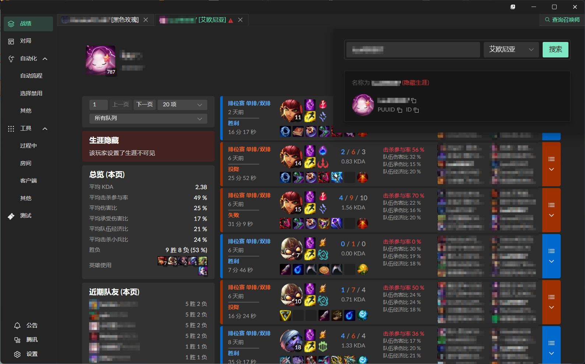
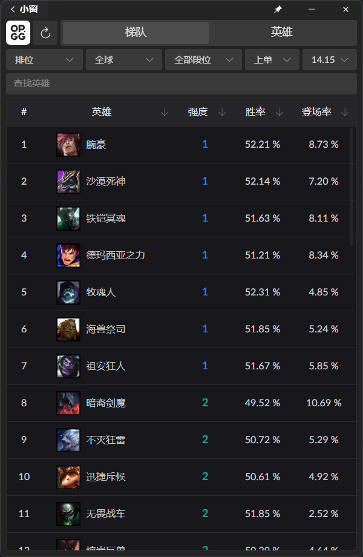
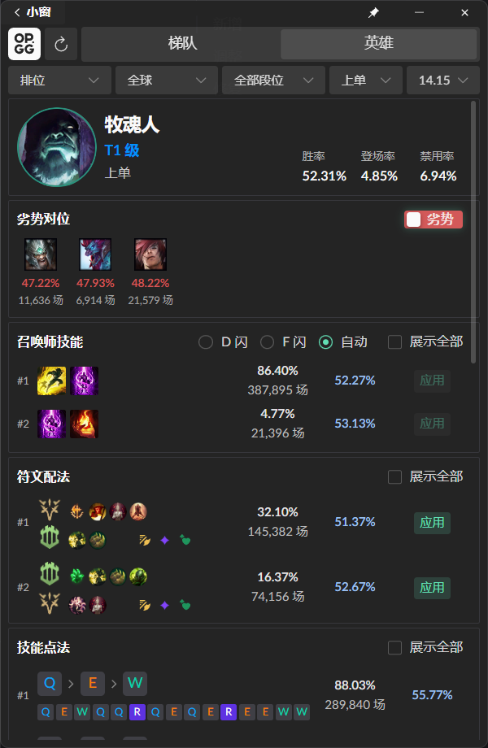
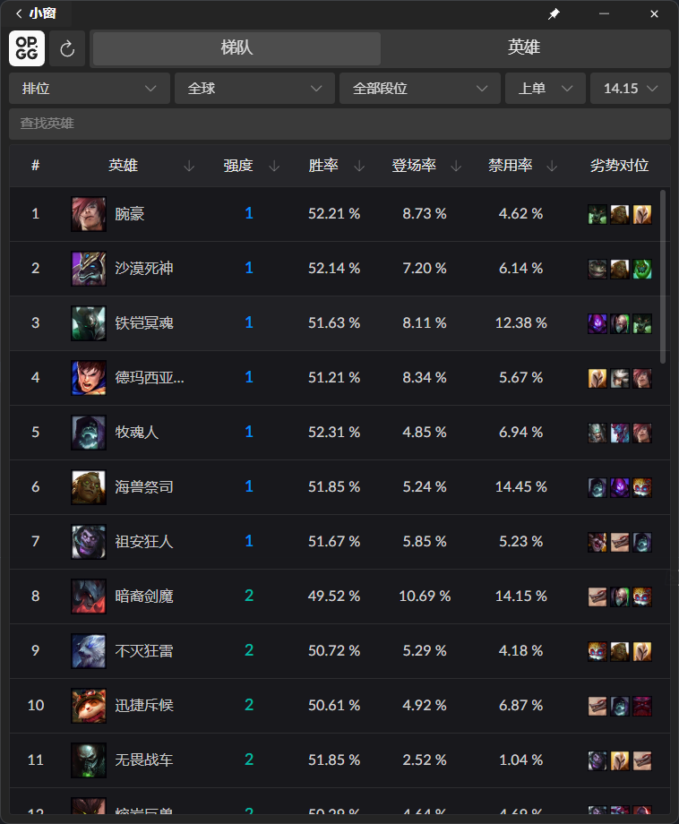
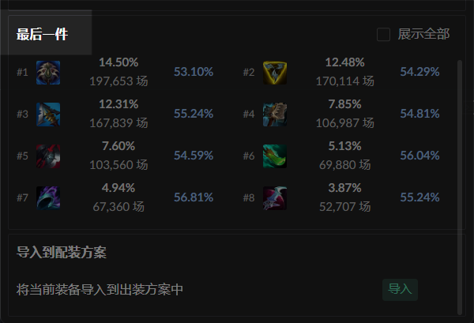
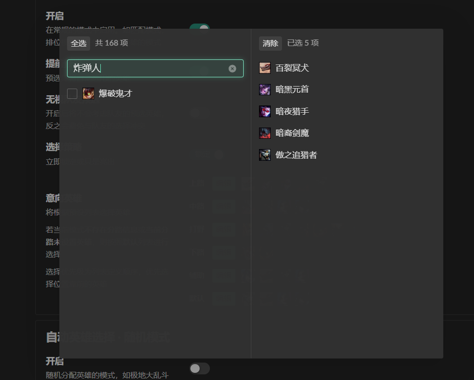
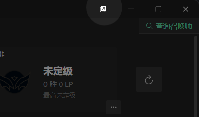
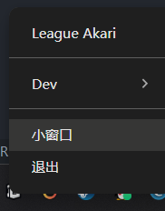
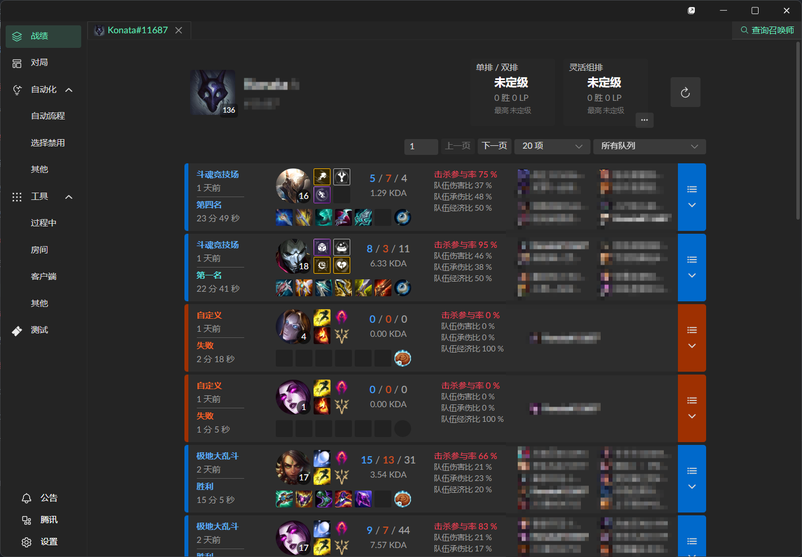

# v1.2.4 (2024-08-12)

## 新增

在 v1.2.4，有这些新的特性。

### 跨区查询支持

现在支持**腾讯服**范围内的跨区战绩查询。由于一些技术性限制，查询结果仅支持战绩数据，不支持排位数据。

需要指定大区以及完整的召唤师名称。

::: tip 注意
涉及到跨区查询，将默认使用 SGP API 作为数据源。
:::

### OP.GG

在辅助窗口添加了 OP.GG，提供召唤师技能、符文、装备等参考以及一键设置功能。

通过小窗口左上角按钮切换到 OP.GG 状态。

进入到 OP.GG 模式。当进入到英雄选择阶段时，会根据当前的模式和英雄自动切换。若当前模式不在支持范围内，则按照**排位**模式处理。

::: tip 提示
通过增加宽度，可以展示更多的列。

:::

::: warning 注意

1. 导入到召唤师技能

   - 若目标技能不存在于当前地图中，则设置会静默失败。

   - 设置技能时，新技能的位置将尽可能**继承原有技能**的位置。若设置了闪现位置偏好，则闪现会按照偏好位置设置。

2. 导入到符文

   由于目前只能同时拥有 2 个符文页，因此若当前已有 2 个符文页，则会覆盖第一个符文页。否则会创建新的符文页。

3. 导入到装备

   在召唤师峡谷和嚎哭深渊地图的模式中，会创建一个仅和当前英雄以及地图相关的装备页。

   由于一些限制，在其他地图（如斗魂竞技场、极限闪击）中，会创建一个通用的、适用于全部地图的装备页。这意味该装备页在所有地图中可见。**请及时清除过多的装备页。**

:::

::: warning 注意
此处的 “最后一件” 为文本错误。实际含义为常见的单件装备。

:::

### 数据源 gtimg

引入了一个数据源 `gtimg`，因此现在自动选择模块的英雄列表，可以按照模糊名称或称号查找。

::: warning 注意
若由于网络原因，无法拉取相关资源，则退化为原有的搜索方式。
:::

### 主窗口标题栏额外按钮

在主窗口标题栏添加了一个按钮，可以快速打开辅助窗口。若辅助窗口已禁用，则该按钮不可见。

::: info 提示
仍可通过托盘区右键菜单唤起辅助窗口。

:::

## 调整

包括了一些调整和改进。

### 辅助窗口的状态

辅助窗口现在划分为两种状态：普通状态和 OP.GG 状态。前者保持原本功能，后者将展示 OP.GG 页面，并且会在英雄选择阶段弹出。可在左上角切换。

- 当位于普通状态时：保持原有功能。

- 当位于 OP.GG 状态时：辅助窗口将不会自动关闭，且会在进入英雄选择阶段时弹出。

### 战绩页面的响应式布局

战绩页面在提供较小宽度时会改变布局，展示更少的内容。

### 移除的设置项

自动选择模块中，移除了 “仅限同步自选模式” 设置项。

该选择本意为使自动选择模块仅在类匹配模式下生效，但就目前来看产生了很多误解。因此移除了该设置项。

## 修复

- (Fixed in v1.2.3) 英雄选择阶段 KDA 发送失效的问题。

- (Fixed in v1.2.3) 自动选择 / 自动禁用不生效的问题。

- 自动更新脚本不支持中文路径的问题。

- 辅助窗口无法再次展示的问题。

- 战绩页面有概率不展示左侧分析数据的问题。
