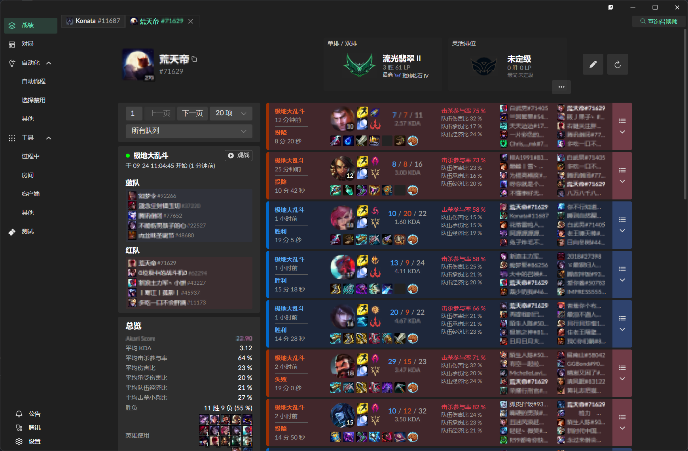
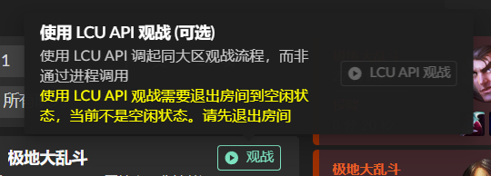
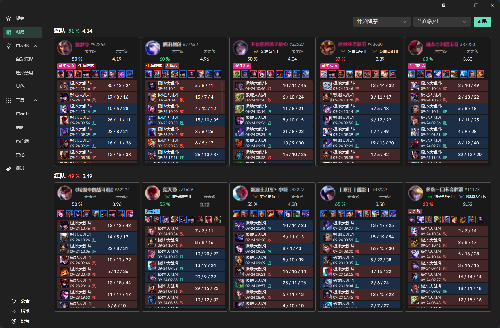

# v1.2.4 (2024-09-24)

## 主要新增特性

在 v1.2.5，有这些新的特性。

### 游戏状态和观战拉起

在使用 SGP API 时，若目标玩家有进行中的对局，则会展示在战绩页面左侧。可以调起观战。

该观战可在腾讯服除体验服外的所有区上进行。

::: tip LCU API 观战
默认采用进程调起的方式来启用客户端观战。但你仍可使用 LCU API，将鼠标移动到观战按钮即可。使用 LCU API 观战需要处于空闲状态。

:::

::: warning 注意
启用观战时，有概率出现黑屏现象。若黑屏始终持续，请手动退出观战进程。
:::

### 新的对局页面 [#91](https://github.com/Hanxven/LeagueAkari/pull/91)，[#38](https://github.com/Hanxven/LeagueAkari/issues/38)

重写了对局页面，现在可以更好地展示对局信息。

将展示胜率、KDA、组队信息、段位、英雄胜率和成就点数等信息。

在使用 SGP API 时，默认情况下，对局页面将优先展示当前对局所处的队列（如位于排位对局，则优先拉取排位对局的战绩），此默认行为可通过右上角下拉选项进行调整。

::: tip 预组队
新的对局页面将使用不同颜色来标记组队玩家，同色将代表推断为同一组队。也可通过卡片上的标签（如 “预组队 A”）来确认。

:::

## 完整新增特性

- 带有英雄选择台的模式，提供了一个设置项，将可以始终选择优先级列表最前面的英雄。([#87](https://github.com/Hanxven/LeagueAkari/issues/87))

- 战绩页面的标签页现在可以通过鼠标中键关闭和打开。([#85](https://github.com/Hanxven/LeagueAkari/pull/85)，[#110](https://github.com/Hanxven/LeagueAkari/issues/110))

- 提供了一个设置项，可以关闭小窗口的自动弹出机制。位于 `设置` -> `通用` -> `小窗口` -> `自动弹出和关闭`。

- 添加了一个设置项，位于 `应用` -> `其他` -> `禁用硬件加速`，可选择是否禁用硬件加速。适用于界面渲染模糊的情况，但也会**显著降低**软件性能。

## 调整

- OP.GG 添加装备方案时，将不会添加到自定义装备方案，而是通过写文件的方式保存。这将避免出现添加失败的情况。([#105](https://github.com/Hanxven/LeagueAkari/issues/105))

- 进行预组队推断时，现在将合并重叠的玩家集合。即：[A, B, C], [B, C, D] 将被视为 [A, B, C, D]。

- 可设置最后一秒秒退的阈值。([#95](https://github.com/Hanxven/LeagueAkari/issues/95))

- 拉取公告内容时，将避免使用缓存。

## 修复

- 平衡性数据在 URF 模式不显示的问题。

- 通过任务栏图标关闭辅助窗口时，再次打开辅助窗口会出现错误。

- 现在可以正确处理被终止的对局战绩。

- 腾讯服体验服不支持 SGP 服务器的问题。
