# v1.3.0 发布公告（2024-12-05）

## 开源协议变更

在此前的版本中，League Akari 采用了 **MIT** 开源协议。然而，我们发现部分开发者对软件进行直接套壳，并将其用于商业用途。虽然这仍然符合 MIT 协议的规定，但与 League Akari 的开发初衷相违背。

在 1.3.0 版本中，我们对底层代码进行了重构。自本版本起，League Akari 的开源协议变更为 [**GPL-3.0**](https://www.gnu.org/licenses/gpl-3.0.html)。

## 新增功能概览

### 英文支持

League Akari 现已支持英文界面。您可以在 `设置` -> `应用` -> `基本` -> `语言` 中切换语言。

### 战绩页面

战绩页面进行了重要更新。现在，您可以关闭当前用户的战绩页面。

默认情况下，应用背景将采用当前用户生涯中使用的背景英雄。

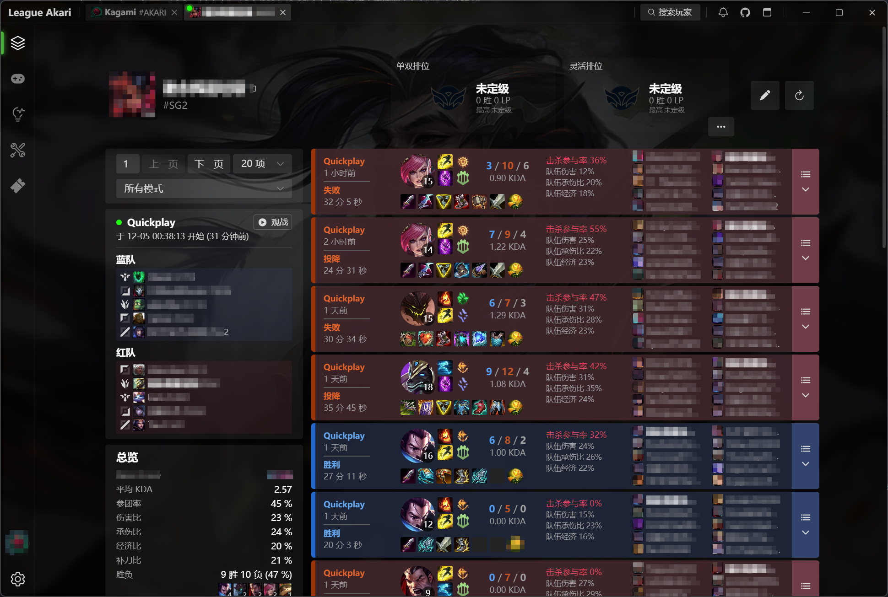

::: tip 关闭默认图片背景
您可以在 `设置` -> `应用` -> `主界面` -> `使用生涯皮肤背景` 中关闭此功能。
:::

::: tip 复制 PUUID（仅供开发者使用）
在当前战绩页面的任意位置输入字符串 `puuid`，即可将部分信息复制到剪贴板，格式如下：
```
SG2  
PUUID: 95c6a340-a1dd-535a-8a6b-be96c7dff220  
召唤师 ID: 3473880283096192  
Kagami#AKARI
```
:::

此外，我们提供了右键菜单，便于您切换、关闭或截图页面。

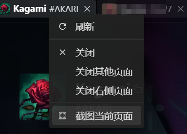

### 召唤师搜索

在新版本中，召唤师搜索被移动到了标题栏的右上角，且仅在战绩页面时可见。

现在支持三种搜索模式：

- **包含名字和标签的精确搜索**：如 `Kagami#AKARI`
- **仅包含名字的模糊搜索**：如 `Akari`
- **PUUID 搜索**：如 `95c6a340-a1dd-535a-8a6b-be96c7dff220`

不可见字符和空白字符将被忽略。

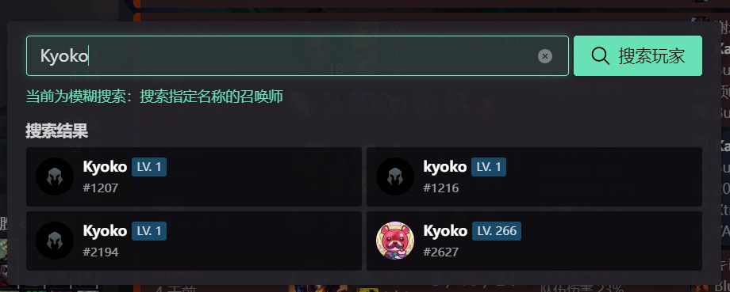

::: tip 注意
在腾讯服务器上搜索召唤师时，需要明确指定大区。
:::

### 标记玩家

在此前版本中，同一大区的玩家标记会相互隔离。现在，它们将同时可见。

### 近期对手

现在不仅会显示近期的队友，还会显示近期的对手。

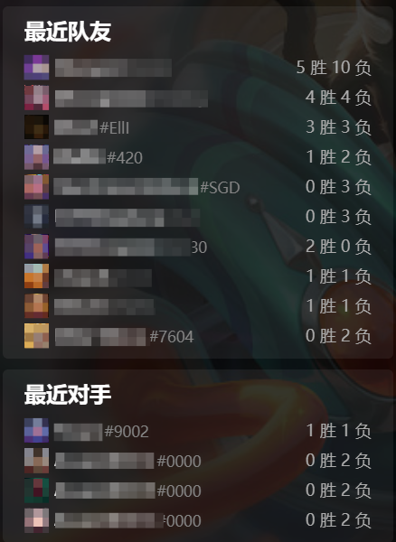

### 对局页面

对局页面进行了重大调整：

1. **降低了对比度**，避免颜色过于鲜艳。
2. **优先展示近期常用位置**：在启用 SGP API 的情况下，对于存在预选位置的模式，将优先显示玩家近期常用的位置，而非之前的系统分配位置。
3. **优化预组队显示**：移除了“预组队”标签，改为使用带颜色的边框和名字文本进行区分。您可以通过鼠标悬停在召唤师名称上查看具体信息。
4. **统计单杀数据**：现在会获取部分对局详情，以统计 14 分钟前的单杀次数和被单杀次数，阈值为 2。
5. **新增排序方式**：提供了按照队伍分配位置和按照预组队情况的两种排序方式。

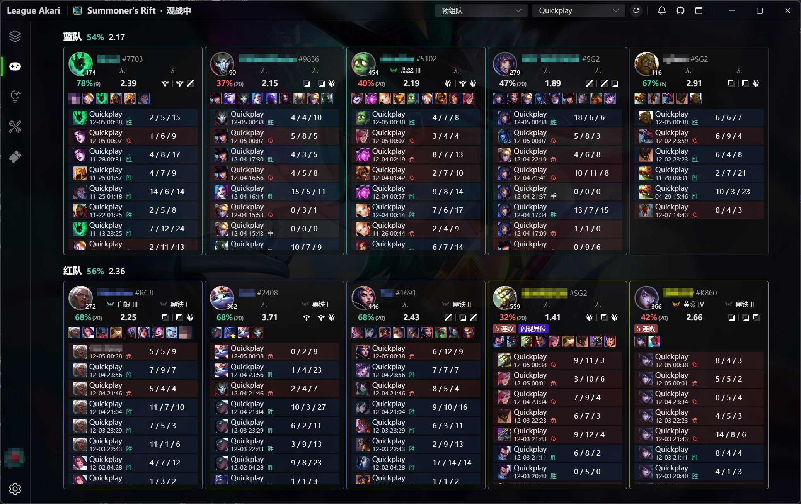

### 快捷键系统

League Akari 实现了自定义快捷键系统，可以在系统层面捕获键盘输入。

涉及快捷键的功能**需要管理员权限**。

快捷键将区分左右两侧的 `Ctrl`、`Alt`、`Shift` 和 `Win` 键。

### 结束客户端和锁定设置项

**结束客户端**功能现在需要设置快捷键，而不再是之前的 Alt + F4。

此外，我们提供了新的功能：**锁定设置项**。在锁定状态下，将阻止客户端更新设置。

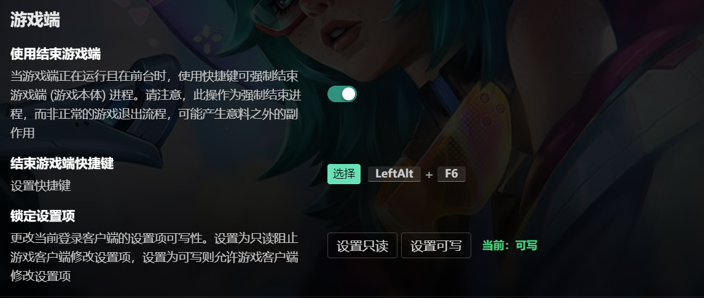

### 游戏中发送 · 自定义固定文案

在 `工具集` -> `游戏中发送` 部分，您现在可以设置更灵活的发送内容。

通过模拟键盘输入（Enter + 输入内容 + Enter...）的方式，在游戏中发送消息。

您可以设置不超过 50 个自定义文案，并分别设置快捷键。

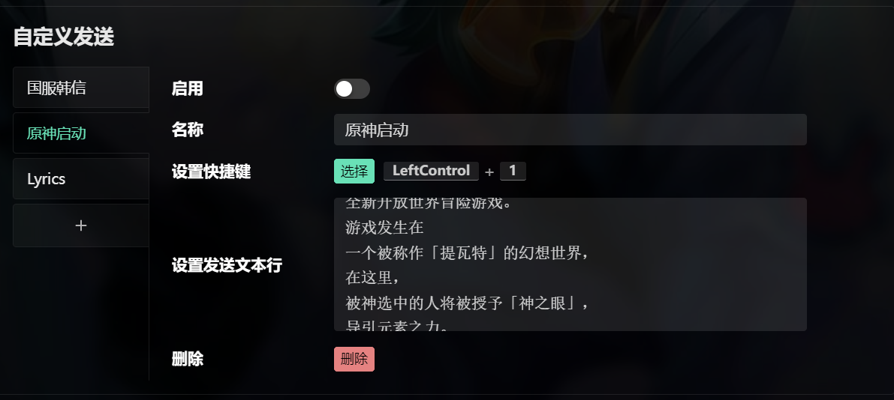

### 游戏中发送 · 自定义战绩模板

之前的 KDA 发送功能已被移除，取而代之的是**自定义模板**。

在英雄选择阶段，消息将发送到聊天室中；在游戏内，将模拟键盘输入发送。

模板使用 [`eta`](https://eta.js.org/) 语法，您可以使用模板变量来构建目标内容。有关数据格式，请参见本章附录。将模板输入并更新，编译通过即可正常使用。

[点击此处](../in-game-send-templates.md)查看一些有趣的模板。

您可以分别设置快捷键，以发送我方、敌方、全体我方或全体敌方的特定内容。

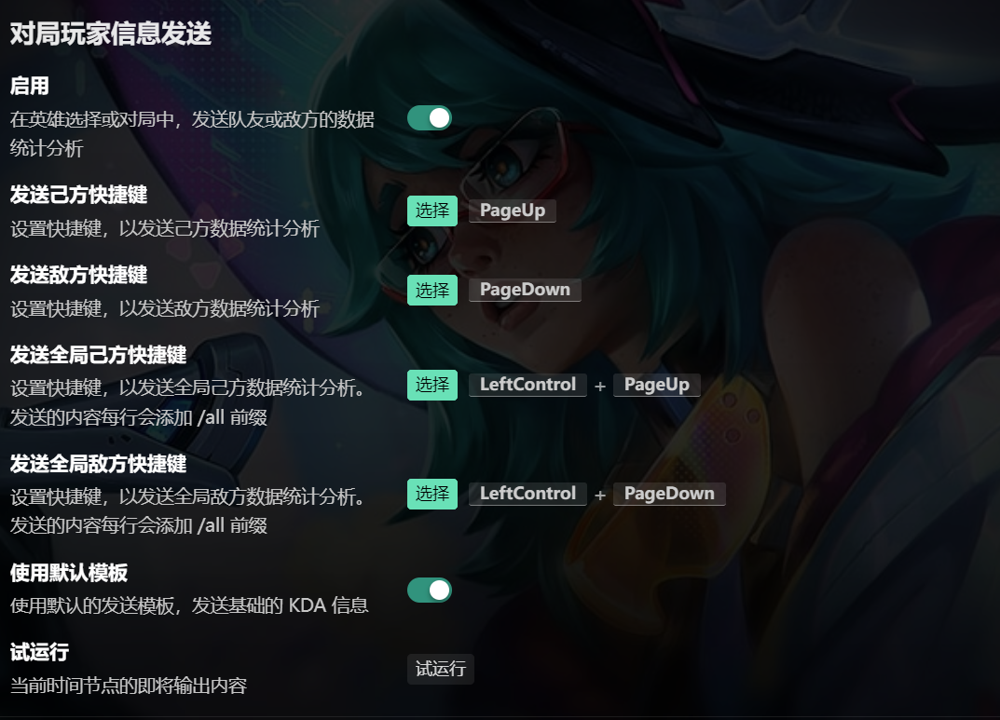

默认情况下，League Akari 提供了一个基础模板，发送内容如下：

```
Thresh：近9场KDA 2.39 胜率 78%
Jhin：近20场KDA 2.15 胜率 37%
Amumu：近20场KDA 2.19 胜率 40%
Illaoi：近6场KDA 2.91 胜率 67%
Ahri：近20场KDA 1.89 胜率 47%
```

::: tip 试运行
您可以使用 **试运行** 功能，预览输出的内容。
:::

::: details 内置默认模板

以下为内置默认模板：

```
<%
const kdaLines = () => {
  if (!it.playerStats) return []

  const puuids = it.targetMembers
  const items = puuids.map((puuid) => {
    let name
    if (it.queryStage.phase === 'champ-select') {
      name = it.summoner[puuid]?.data.gameName || '未知召唤师'
    } else {
      let selection = it.championSelections[puuid] || -1
      name = it.gameData.champions[selection]?.name || '未知英雄'
    }

    const {
      averageKda = 0,
      count = 0,
      winRate = 0
    } = it.playerStats.players[puuid]?.summary || {}
    return { puuid, name, averageKda, count, winRate }
  })
  .map(({ name, averageKda, count, winRate }) => `${name}：近${count}场KDA ${averageKda.toFixed(2)} 胜率 ${(winRate * 100).toFixed(0)}%`)

  return items
}
%>
<%= kdaLines().join('\n') %>
```

:::

### 快捷启动

League Akari 将通过多种方式自动检测系统中 WeGame、TCLS 和英雄联盟客户端的安装位置。

在未连接到客户端时，将提供一系列快捷启动按钮。

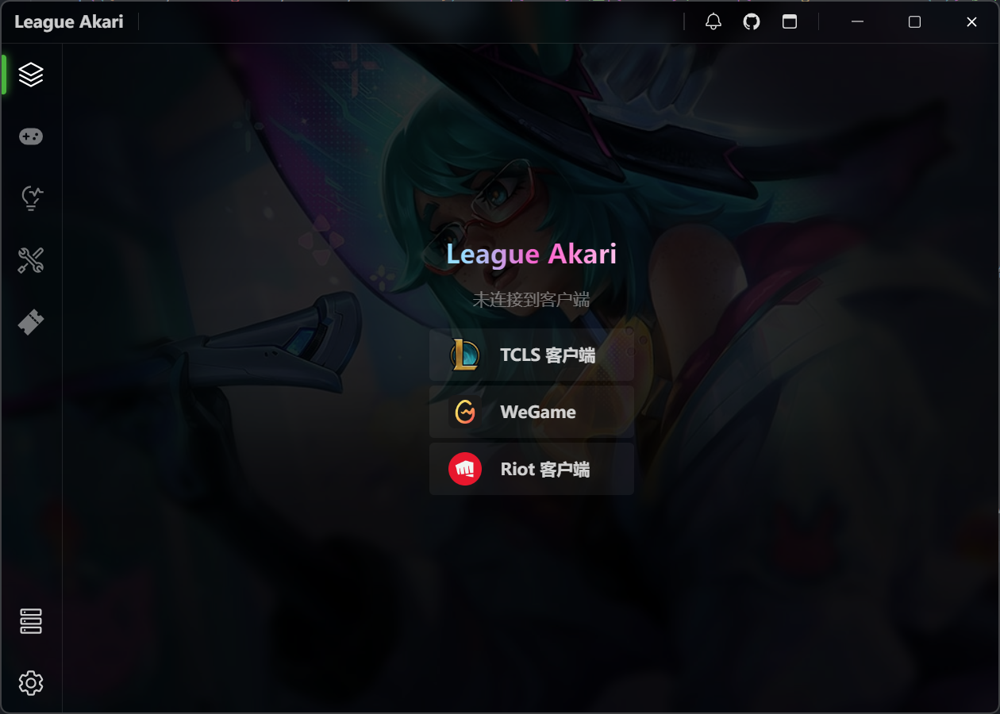

### 观战分享

在观战页面，您可以复制本场比赛的观战口令。

将其粘贴到 `工具集` -> `百宝箱` -> `观战` -> `口令观战` 中，即可启动观战流程。通常情况下，League Akari 会自动填充已复制的口令。

即使在**未连接到客户端**的情况下，也可以通过口令启动观战。

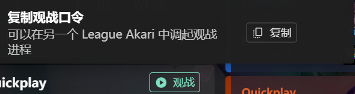

然后：

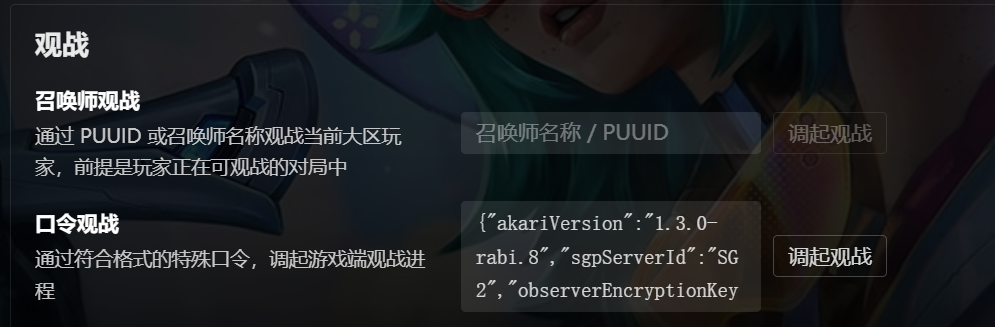

::: warning 观战问题
在直营服中，由于 Vanguard 的存在，不允许外部程序启动英雄联盟游戏进程。因此，如果要使用非 LCU API 的观战功能，需要关闭 Vanguard。
:::

---

## 附：自定义模板类型定义

以下为部分定义。将会被作为 `eta` 的模板环境变量。

其包含了几乎所有 League Akari 已经加载的数据结构，包括对局战绩、静态资源以及部分统计分析数据。

```ts
import {
  Augment,
  ChampionSimple,
  Item,
  Perk,
  Perkstyles,
  Queue,
  SummonerSpell
} from '@shared/types/league-client/game-data'
import { Game, GameTimeline } from '@shared/types/league-client/match-history'
import { RankedStats } from '@shared/types/league-client/ranked'
import { SummonerInfo } from '@shared/types/league-client/summoner'
import {
  MatchHistoryGamesAnalysisAll,
  MatchHistoryGamesAnalysisTeamSide
} from '@shared/utils/analysis'
import { ParsedRole } from '@shared/utils/ranked'

import { EncounteredGame } from '../storage/entities/EncounteredGame'
import { SavedPlayer } from '../storage/entities/SavedPlayers'

interface GameDataEnv {
  summonerSpells: Record<number | string, SummonerSpell>
  items: Record<number | string, Item>
  queues: Record<number | string, Queue>
  perks: Record<number | string, Perk>
  perkstyles: Record<number | string, Perkstyles['styles'][number]>
  augments: Record<number | string, Augment>
  champions: Record<number | string, ChampionSimple>
}

/** ETA Env */
declare const it: TemplateEnv

interface TeamsEnv {
  [key: string]: string[]
}

interface MatchHistoryEnv {
  [key: string]: {
    source: 'lcu' | 'sgp'
    tag?: string
    targetCount: number
    data: Game[] // lcu game object, detailed
  }
}

interface RankedStatsEnv {
  [key: string]: {
    source: 'lcu'
    data: RankedStats
  }
}

interface SummonerEnv {
  [key: string]: {
    source: 'lcu'
    data: SummonerInfo
  }
}

interface GameTimelineEnv {
  [key: number]: {
    source: 'lcu'
    data: GameTimeline
  }
}

interface NotUnavailableEnv {
  phase: 'champ-select' | 'in-game'
  gameInfo: {
    queueId: number
    queueType: string
    gameId: number
    gameMode: string
  }
}

interface UnavailableEnv {
  phase: 'unavailable'
  gameInfo: null
}

type QueryStageEnv = NotUnavailableEnv | UnavailableEnv

interface ChampionMasteryEnv {
  [key: string]: {
    source: 'lcu' | 'sgp'
    data: Record<
      number,
      {
        championId: number
        championLevel: number
        championPoints: number
      }
    >
  }
}

interface SavedInfoEnv {
  [key: string]: SavedPlayer & { encounteredGames: EncounteredGame[] }
}

interface ChampionSelectionsEnv {
  [key: string]: number
}

interface PositionAssignmentsEnv {
  [key: string]: {
    position: string
    role: ParsedRole | null
  }
}

interface PlayerStatsEnv {
  players: Record<string, MatchHistoryGamesAnalysisAll>
  teams: Record<string, MatchHistoryGamesAnalysisTeamSide>
}

interface PremadeTeamsEnv {
  [key: string]: string[][]
}

export type TemplateEnv = {
  /**
   * Version of League Akari
   */
  akariVersion: string

  /**
   * '/all' or something else
   */
  prefix?: string

  /**
   * Whom will be sent stats to
   */
  target: 'ally' | 'enemy' | 'all'

  /**
   * currently only zh-CN or en
   */
  locale: string

  utils: {
    isBotQueue: (queueId: number) => boolean
    isPveQueue: (queueId: number) => boolean
  }
  /**
   * Region, for eg. TENCENT, SG2
   */
  region: string

  /**
   * Available only in TENCENT region
   */
  rsoPlatformId: string

  /**
   * Self Puuid
   */
  selfPuuid: string

  /**
   * Self Team Id, if not in any team, it will be null.
   */
  selfTeamId: string | null

  /**
   * League Client Game Data Assets, not a completed list.
   * includes:
   * - summonerSpells
   * - items
   * - queues
   * - perks
   * - perkstyles
   * - augments
   * - champions, (summary)
   */
  gameData: GameDataEnv

  /**
   * Ally members. If not in a team, it will be empty.
   */
  allyMembers: string[]

  /**
   * Enemy members.
   */
  enemyMembers: string[]

  /**
   * All members.
   */
  allMembers: string[]

  /**
   * Target members.
   */
  targetMembers: string[]

  /**
   * Teams environment including team data for each player.
   */
  teams: TeamsEnv

  /**
   * Match history environment including match history data for each player.
   */
  matchHistory: MatchHistoryEnv

  /**
   * Ranked stats environment including ranked stats data for each player.
   */
  rankedStats: RankedStatsEnv

  /**
   * Summoner environment including summoner data for each player.
   */
  summoner: SummonerEnv

  /**
   * Query stage environment including game information and phase.
   */
  queryStage: QueryStageEnv

  /**
   * Champion mastery environment including champion mastery data for each player.
   * Note: Simplified version
   */
  championMastery: ChampionMasteryEnv

  /**
   * Saved player information including encountered games.
   */
  savedInfo: SavedInfoEnv

  /**
   * Champion selections environment including champion selections for each player.
   */
  championSelections: ChampionSelectionsEnv

  /**
   * Position assignments environment including position and role assignments for each player.
   */
  positionAssignments: PositionAssignmentsEnv

  /**
   * Player stats environment including player and team stats.
   * If there's no player stats, it will be null.
   */
  playerStats: PlayerStatsEnv | null

  /**
   * Premade teams
   */
  premadeTeams: PremadeTeamsEnv

  /**
   * Game timeline environment including game timeline data for a certain count of games.
   */
  gameTimeline: GameTimelineEnv

  /**
   * Settings from shard ongoing-game-main (including only non-function fields)
   */
  settings: Record<string, any>
}
```
